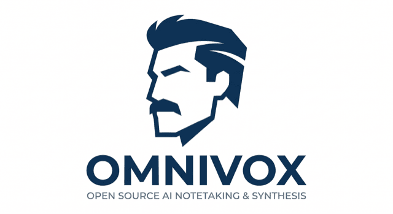

<h1 align="center">OmniVox</h1>

<p align="center">
  
</p>

<p align="center">
  <em>Upload audio, transcribe it, and turn it into meeting summaries, diagrams, actions, transcripts, and exports.</em>
</p>

---

The project is meant to be easy to try locally without relying on external services for login and storage. The compose stack starts Keycloak, MinIO, Postgres, and Redis.

The AI backend is configurable. You can use an OpenAI business/API key, or point `OPENAI_BASE_URL` to a service that is compatible with the OpenAI APIs used by the project. That means a company can keep the app, identity, storage, and database under its own control, then choose the AI backend that fits its policies.

## What It Does

- Direct browser upload to S3-compatible storage with presigned URLs
- Audio transcription handled by a separate worker
- Report with summary, sentiment, participants, and transcript segments
- Diagrams and actions generated only when needed
- Actions classified as `task`, `decision`, `risk`, or `follow_up`
- Markdown, Slack/Teams, and calendar exports
- Optional Keycloak login with tenant/user isolation
- Light/dark theme and localized dashboard
- Dedicated routes for overview, new analysis, and reports (`/`, `/new`, `/executions/{jobId}`)

## Stack

- `apps/web`: Next.js 15, TypeScript, UI, and `/api/v1/*` routes
- `apps/worker`: Node.js worker with BullMQ
- `packages/shared`: Zod schemas and shared types
- `packages/security`: helpers for storage keys and S3 headers
- `packages/wasm-audio`: experimental contracts for future client-side audio preprocessing
- Postgres: job metadata, report results, actions, artifacts, generation status, and audit data
- Redis: job queue and session token store
- MinIO: local S3-compatible object storage
- Keycloak: local OIDC identity provider

## Requirements

- Node.js 20+
- npm
- Docker and Docker Compose
- an OpenAI key, or a service compatible with the OpenAI APIs used by the project

## Local Setup

1. Start the local infrastructure:

```bash
docker compose up -d
```

2. Create local env files:

```bash
cp apps/web/.env.example apps/web/.env.local
cp apps/worker/.env.example apps/worker/.env.local
```

3. Set `OPENAI_API_KEY` in both `.env.local` files. If you use a compatible endpoint instead of the default OpenAI endpoint, also set `OPENAI_BASE_URL`.

4. Apply the database schema:

```bash
npm run db:migrate
```

5. Start web and worker in two terminals:

```bash
npm run dev
npm run dev:worker
```

6. Open `http://localhost:3000`.

Main routes:

```text
/                    overview
/new                 new analysis
/executions/{jobId}  analysis report
```

## Local Services

| Service       | URL / port              | Credentials             |
| ------------- | ----------------------- | ----------------------- |
| Web           | `http://localhost:3000` | handled by the app      |
| Keycloak      | `http://localhost:8080` | admin / admin           |
| MinIO console | `http://localhost:9001` | minioadmin / minioadmin |
| Postgres      | `localhost:5432`        | postgres / postgres     |
| Redis         | `localhost:6379`        | none                    |

The local MinIO bucket is `omnivox`.

## Demo Login

The compose stack imports the `omnivox` Keycloak realm with two demo users in the same `acme` tenant. They are useful for checking that analyses created by one user are not visible to the other.

| Username | Password | Tenant |
| -------- | -------- | ------ |
| `demo`   | `demo`   | `acme` |
| `demo2`  | `demo2`  | `acme` |

If Keycloak was already started before the realm file changed, the import is not applied again automatically. Recreate the Keycloak volume or add the user manually from the admin console.

To use Keycloak, set this in the web env:

```env
AUTH_MODE=keycloak
APP_BASE_URL=http://localhost:3000
KEYCLOAK_ISSUER_URL=http://localhost:8080/realms/omnivox
KEYCLOAK_CLIENT_ID=omnivox-web
KEYCLOAK_CLIENT_SECRET=omnivox-local-secret
```

`AUTH_MODE=disabled` uses `DEFAULT_TENANT_ID` and is intended for local development only.

## S3-Compatible Storage

The local configuration points to MinIO:

```env
S3_ENDPOINT=http://localhost:9000
S3_REGION=us-east-1
S3_BUCKET=omnivox
S3_ACCESS_KEY_ID=minioadmin
S3_SECRET_ACCESS_KEY=minioadmin
S3_FORCE_PATH_STYLE=true
S3_SERVER_SIDE_ENCRYPTION=
S3_CHECKSUM_ENABLED=true
```

To use another S3-compatible provider, change the `S3_*` variables. If the provider does not support SHA-256 checksum headers on presigned uploads, set `S3_CHECKSUM_ENABLED=false`. If it requires server-side encryption, set `S3_SERVER_SIDE_ENCRYPTION`, for example `AES256`.

## Audio Formats

The direct upload flow accepts:

```text
flac, mp3, mp4, mpeg, mpga, m4a, ogg, wav, webm
```

The current limit is 25 MiB. Client-side chunking is not implemented yet.

Today the original file is uploaded to storage and processed by the worker. `packages/wasm-audio` is preparatory work: it may later be used for audio metrics, resampling, chunking, or browser-side preprocessing, but it is not part of the main pipeline yet.

## Privacy and GDPR

OmniVox does not store application-level user profiles. In Keycloak mode, jobs only keep:

- `tenant_id`
- `owner_issuer`
- `owner_subject`

Audio and results stay in the storage and database chosen by whoever installs the project. With the local compose stack, they stay on your machine. When the pipeline runs, audio and text are sent to OpenAI for transcription and analysis according to the account and contract you configure.

If `OPENAI_BASE_URL` is set, audio and text are sent to that endpoint instead of the default OpenAI endpoint. The service must support the endpoints OmniVox actually uses: audio transcription, chat/responses, and the configured models.

For a real deployment, define retention, deletion, legal basis, privacy notice, and access policy. The main notes are in [`docs/PRIVACY.md`](docs/PRIVACY.md).

## Useful Commands

```bash
npm run db:migrate
npm run typecheck
npm run typecheck:worker
npm run test
npm run build
npm run build:worker
```

Worker probes:

```bash
curl -s http://localhost:4010/health
curl -s http://localhost:4010/ready
```

## Documentation

- [`docs/README.md`](docs/README.md): documentation index
- [`docs/ARCHITECTURE.md`](docs/ARCHITECTURE.md): architecture, runtime flow, main APIs, and configuration
- [`docs/PRIVACY.md`](docs/PRIVACY.md): privacy and GDPR notes
- [`docs/TROUBLESHOOTING.md`](docs/TROUBLESHOOTING.md): common issues
- [`ROADMAP.md`](ROADMAP.md): planned or desired work
- [`CONTRIBUTING.md`](CONTRIBUTING.md): how to set up and contribute
- [`SECURITY.md`](SECURITY.md): how to report vulnerabilities

## License

Apache-2.0. See [`LICENSE`](LICENSE).
